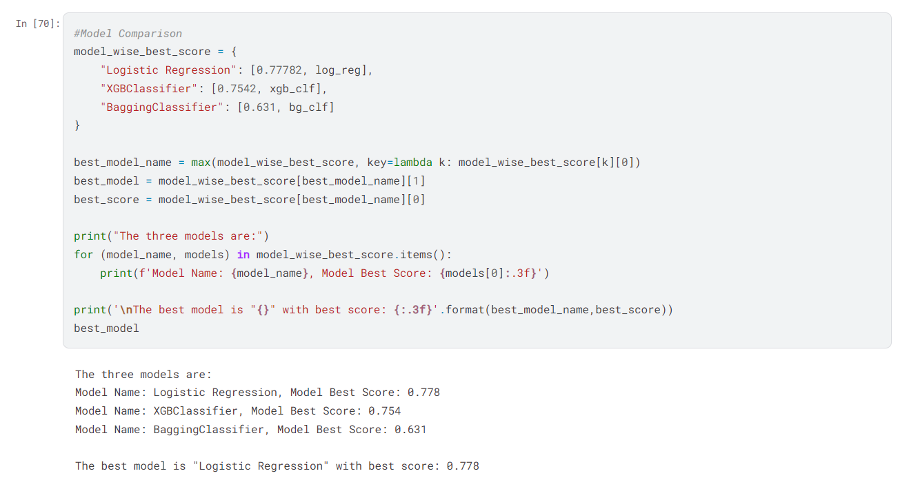

# Recipe-for-Rating-Predict-Food-Ratings-using-ML  

A Machine Learning Project to Predict Food Ratings for a restaurant.

- Developed machine learning models to predict food ratings using multiple classification algorithms including LogisticRegression, XGBClassifier, BaggingClassifier, Random Forest.
- Preprocessed data using techniques like Label Encoding, StandardScaler, and MinMaxScaler to handle categorical and numerical variables.
- Addressed class imbalance with SMOTE for oversampling and RandomUnderSampler for undersampling.
- Performed dimensionality reduction using Principal Component Analysis (PCA) to improve computational efficiency.
- Fine-tuned models using GridSearchCV to optimize hyperparameters and improve accuracy.
- Evaluated model performance with accuracy, F1-score, and confusion matrices.
- Visualized results with matplotlib and seaborn to gain insights into model performance and feature importance.

